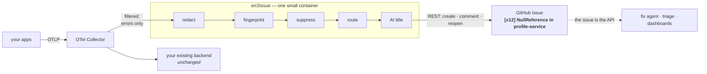
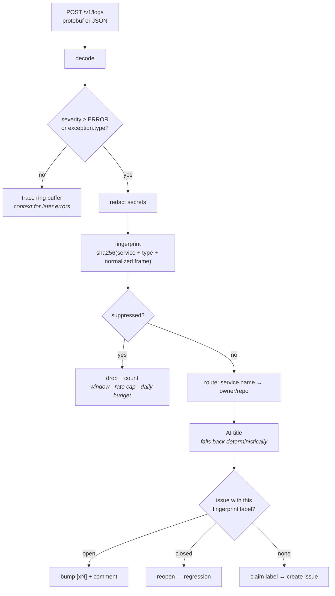

# err2issue

**Meet every production error exactly once.**

OpenTelemetry errors in, deduplicated GitHub issues out.

[](https://github.com/matthiasbigl/err2issue/actions/workflows/ci.yml)
&nbsp;Python 3.11+ &nbsp;·&nbsp; Apache-2.0 &nbsp;·&nbsp; ~15 MB container

---

## The idea

Think about the last error you fixed. You almost certainly met it more than
once: in a dashboard you happened to open, in a Slack thread three weeks later,
in a bug report from someone who hit it in production while you were reading
about it in staging. Each of those encounters cost you the same twenty minutes
of *is this the thing I already looked at?*

That work is pure waste, and it is waste a machine can do. An error has an
identity — service, exception type, and the frame where it was raised — and two
errors with the same identity are the same bug no matter how far apart they
happen. Everything else follows from computing it:

**The first time it happens**, an issue appears in the right repository, titled
in plain language, carrying the stack trace, the log lines from the same trace
immediately before the failure, and the runtime attributes. Enough to act on
without opening a telemetry backend.

**The eight hundredth time**, that same issue says `[x800]`. No new issue, no
new notification, no thread of duplicates for someone to close by hand. The
number is the signal, and it is the number you sort by when you decide what to
fix on Monday.

**If it comes back after you fixed it**, the issue you closed reopens itself.
That reopen is the most valuable event in the system, because it is the only
honest answer to *did the fix actually hold?*

**And because the issue is the whole interface**, a fix agent is just another
reader. Two are [set up and verified here](#closing-the-loop-issue--fix). File
the issue, and something can already be opening the pull request.

No database. No dashboard. No new destination to run. **GitHub is the store, the
UI, and the notification system** — one small container between your collector
and your issue tracker, and your applications never learn it exists.

## How it works



Adding it is a **collector-config change only** — a filter processor and an
exporter, on a pipeline of their own so it cannot affect what reaches your
existing backend. Removing it is a one-line revert.

## The pipeline, in order



Ordering is deliberate. Redaction runs before fingerprinting, so a leaked token
can never change an error's identity, and before enrichment, so it is never sent
to a model. Suppression runs before routing and enrichment, so a crash loop
costs one dict lookup rather than an API call.

## Quick start

```bash
git clone https://github.com/matthiasbigl/err2issue && cd err2issue
cp .env.example .env          # set E2I_GITHUB_TOKEN and E2I_GITHUB_REPO
docker compose up --build
./examples/send-sample-error.sh
```

An issue appears in your repository. Run the script again: the second call is
absorbed by the suppression window rather than filing anything.

**No credentials handy?** Set `E2I_SINK=dry-run` and err2issue logs every issue
it *would* have filed, writing nothing.

### The two settings that matter

```bash
E2I_GITHUB_TOKEN=ghp_...        # or a GitHub App — see docs/DEPLOY.md
E2I_GITHUB_REPO=owner/repo      # default destination
```

For an organisation, route by service instead:

```bash
E2I_ROUTE_MAP=checkout-api=acme/checkout,cart-*=acme/cart,*-worker=acme/workers
```

Everything else is documented in [.env.example](.env.example). err2issue
**refuses to start** on an unusable configuration rather than accepting
telemetry it would silently drop.

## What lands in the issue

```
[x12] Cart total fails when an item has no price
```

- Machine-readable fingerprint header that consumers can parse
- First seen / last seen / occurrence count
- Service, version, severity, trace id
- Exception type, message, and stack trace
- **The log lines from the same trace, immediately before the failure**
- Runtime attributes — route, status code, environment

The correlated log lines are the part people do not expect and end up relying
on: err2issue keeps a ring buffer of records by trace id, so when an error
arrives it can attach what the same request was doing in the seconds before it
failed. That is usually the difference between a stack trace and an explanation.

The format is a contract, not a rendering detail — which is what lets anything
read it: [docs/ISSUE_CONTRACT.md](docs/ISSUE_CONTRACT.md).

## Closing the loop: issue → fix

The issue is the API, so a fix agent is just another reader. Two verified
setups ship in [integrations/](integrations/):

| | What it does |
|---|---|
| **[Claude Code Action](integrations/claude-code-action/)** | Triage-only (comments + severity labels), or full autofix that opens a PR |
| **[gh-aw](integrations/gh-aw/)** | Agentic workflow where the framework bounds what the agent can do via `safe-outputs` |

Both are configurable on *when* they fire — label, occurrence threshold, comment
command, manual, or off. Each ships a README for humans and an `AGENTS.md` so an
agent can set it up correctly.

**Start with triage.** It only comments, costs little, and shows whether the
context is rich enough on your codebase before you let anything write code.


## Deployment

Works with any GitHub: github.com, GitHub Enterprise Server, and GHE.com data
residency. Authenticate with a PAT, or with a **GitHub App** for org-wide
deployment — one App files into every repo it is granted, with a rate limit that
scales with the installation rather than a fixed per-user budget.

See [docs/DEPLOY.md](docs/DEPLOY.md).

## Documentation

| | |
|---|---|
| [docs/DEPLOY.md](docs/DEPLOY.md) | Collector config, GitHub App setup, org routing, Kubernetes |
| [docs/ISSUE_CONTRACT.md](docs/ISSUE_CONTRACT.md) | The issue format, for consumers and producers |
| [docs/FINGERPRINT.md](docs/FINGERPRINT.md) | Normalization rules and the versioning policy |
| [CHALLENGE.md](CHALLENGE.md) | Design review of PLAN.md |
| [AGENTS.md](AGENTS.md) | Repository conventions, gotchas, accumulated context |
| [CONTRIBUTING.md](CONTRIBUTING.md) | Setup, tests, Conventional Commits |

## Development

```bash
uv sync --group dev
uv run pytest                        # full suite, ~6s
uv run ruff check src tests scripts
uv run ruff format src tests scripts
uv run python scripts/check_docs.py  # links + Mermaid conventions
```

Nothing in the suite touches the network: `respx` intercepts every GitHub call
and time is injected, so rate limits and suppression windows are tested by
advancing a fake clock rather than sleeping.

## Non-goals

No UI. No metrics pipeline. No query API. No automated fixing — err2issue ends
at the issue, and fix agents are consumers rather than components. This is a
pipe, not a platform.

## License

Apache-2.0
