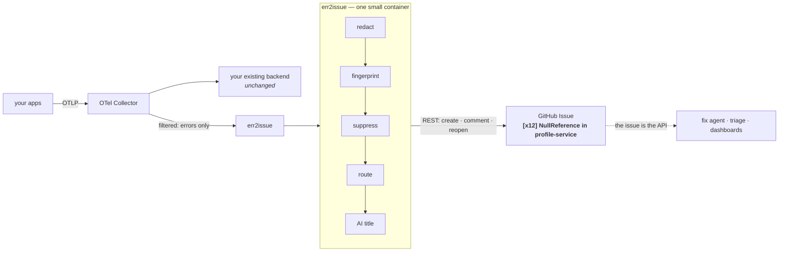
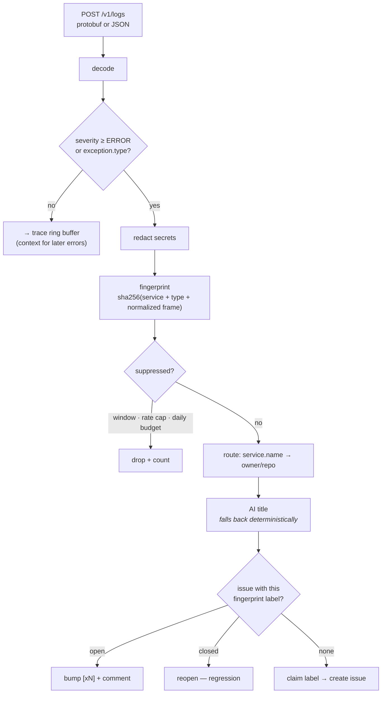

# err2issue

**OpenTelemetry errors in, deduplicated GitHub issues out.**

Every *unique* production error becomes exactly one GitHub issue — with an
AI-written title, an occurrence counter in the title (`[x12] …`), and all the
context a human *or an automated fix agent* needs to act on it.

No database. No dashboard. No new destination to run. **GitHub is the store, the
UI, and the notification system.**

[](https://github.com/matthiasbigl/err2issue/actions/workflows/ci.yml)
&nbsp;Python 3.11+ &nbsp;·&nbsp; Apache-2.0 &nbsp;·&nbsp; ~15 MB container

---

## How it works



Your applications never learn err2issue exists. Adding it is a **collector-config
change only**, and removing it is a one-line revert.

## The pipeline, in order



Ordering is deliberate. Redaction runs before fingerprinting, so a leaked token
can never change an error's identity, and before enrichment, so it is never sent
to a model. Suppression runs before routing and enrichment, so a crash loop
costs one dict lookup rather than an API call.

## Quick start

```bash
git clone https://github.com/matthiasbigl/err2issue && cd err2issue
cp .env.example .env          # set E2I_GITHUB_TOKEN and E2I_GITHUB_REPO
docker compose up --build
./examples/send-sample-error.sh
```

An issue appears in your repository. Run the script again: the second call is
absorbed by the suppression window rather than filing anything.

**No credentials handy?** Set `E2I_SINK=dry-run` and err2issue logs every issue
it *would* have filed, writing nothing.

### The two settings that matter

```bash
E2I_GITHUB_TOKEN=ghp_...        # or a GitHub App — see docs/DEPLOY.md
E2I_GITHUB_REPO=owner/repo      # default destination
```

For an organisation, route by service instead:

```bash
E2I_ROUTE_MAP=checkout-api=acme/checkout,cart-*=acme/cart,*-worker=acme/workers
```

Everything else is documented in [.env.example](.env.example). err2issue
**refuses to start** on an unusable configuration rather than accepting
telemetry it would silently drop.

## What lands in the issue

```
[x12] Cart total fails when an item has no price
```

- Machine-readable fingerprint header that consumers can parse
- First seen / last seen / occurrence count
- Service, version, severity, trace id
- Exception type, message, and stack trace
- **The log lines from the same trace, immediately before the failure**
- Runtime attributes — route, status code, environment

Enough to act on without opening your telemetry backend. That is the design
goal, and it is what makes the output useful to an agent as well as a person.

The format is a contract, not a rendering detail:
[docs/ISSUE_CONTRACT.md](docs/ISSUE_CONTRACT.md).

## Closing the loop: issue → fix

The issue is the API, so a fix agent is just another reader. Two verified
setups ship in [integrations/](integrations/):

| | What it does |
|---|---|
| **[Claude Code Action](integrations/claude-code-action/)** | Triage-only (comments + severity labels), or full autofix that opens a PR |
| **[gh-aw](integrations/gh-aw/)** | Agentic workflow where the framework bounds what the agent can do via `safe-outputs` |

Both are configurable on *when* they fire — label, occurrence threshold, comment
command, manual, or off. Each ships a README for humans and an `AGENTS.md` so an
agent can set it up correctly.

**Start with triage.** It only comments, costs little, and shows whether the
context is rich enough on your codebase before you let anything write code.

## Design

This repository began as a design document. Before implementing it, the design
was reviewed and several parts were found wanting — most seriously, the original
dedup mechanism could not deliver the "exactly one issue" guarantee it promised.

- **[PLAN.md](PLAN.md)** — the original design
- **[CHALLENGE.md](CHALLENGE.md)** — what was wrong with it and what changed

The three changes worth knowing:

**Dedup reads the issues table, not the search index.** `GET /repos/{o}/{r}/issues?labels=…&state=all`
is strongly consistent. `GET /search/issues` is an eventually-consistent index,
rate-limited to 30/min, capped at 1,000 results, and explicitly allowed to return
partial results — so it reports "no issue exists" for one created seconds ago,
and a crash loop produces duplicates.

**Label creation is the distributed mutex.** `POST /labels` returns 201 to
exactly one caller and 422 to everyone else, arbitrated by GitHub's own database.
Two replicas, one issue — no coordination service, no owned state.

**Redaction is on by default.** Everywhere else in a telemetry stack an
unredacted secret lands behind SSO with a retention limit. Here it lands in a
GitHub issue: indexed, emailed to watchers, and permanently public on a public
repo. Inheriting the upstream posture unchanged is not a neutral choice.

## Deployment

Works with any GitHub: github.com, GitHub Enterprise Server, and GHE.com data
residency. Authenticate with a PAT, or with a **GitHub App** for org-wide
deployment — one App files into every repo it is granted, with a rate limit that
scales with the installation rather than a fixed per-user budget.

See [docs/DEPLOY.md](docs/DEPLOY.md).

## Documentation

| | |
|---|---|
| [docs/DEPLOY.md](docs/DEPLOY.md) | Collector config, GitHub App setup, org routing, Kubernetes |
| [docs/ISSUE_CONTRACT.md](docs/ISSUE_CONTRACT.md) | The issue format, for consumers and producers |
| [docs/FINGERPRINT.md](docs/FINGERPRINT.md) | Normalization rules and the versioning policy |
| [CHALLENGE.md](CHALLENGE.md) | Design review of PLAN.md |
| [AGENTS.md](AGENTS.md) | Repository conventions, gotchas, accumulated context |
| [CONTRIBUTING.md](CONTRIBUTING.md) | Setup, tests, Conventional Commits |

## Development

```bash
uv sync --group dev
uv run pytest                      # 270 tests
uv run ruff check src tests
uv run ruff format src tests
```

Nothing in the suite touches the network: `respx` intercepts every GitHub call
and time is injected, so rate limits and suppression windows are tested by
advancing a fake clock rather than sleeping.

## Non-goals

No UI. No metrics pipeline. No query API. No automated fixing — err2issue ends
at the issue, and fix agents are consumers rather than components. This is a
pipe, not a platform.

## License

Apache-2.0
