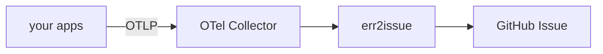

# Diagrams

Sources live here so diagrams stay editable. A picture with no source is a dead
end — the next person has to redraw it from scratch to change one box.

## Policy

**Mermaid is the default.** It renders natively on GitHub, diffs as text, needs
no tooling, and lives inline with the prose it explains. Use it for
architecture, flows, sequences, and state machines — every diagram in
[README.md](../../README.md) and [ISSUE_CONTRACT.md](../ISSUE_CONTRACT.md) is
Mermaid.

**Excalidraw for conceptual sketches** where the hand-drawn quality carries
meaning: whiteboard-style overviews, annotated explanations, anything you would
actually draw on a whiteboard. Commit the `.excalidraw` file here.

Whichever you use: **if you change the architecture, change the diagram in the
same pull request.** A stale diagram is worse than none, because people trust it.

## Files

| File | Shows | Embedded in |
|---|---|---|
| `architecture.excalidraw` | Whiteboard overview of the end-to-end flow: apps → collector → err2issue pipeline → GitHub issue → consumers | nothing — kept as a source for talks and slides |

The rendered version of that flow lives in [README.md](../../README.md) as
Mermaid. The Excalidraw file is the sketch you would draw on a whiteboard to
explain it out loud; keep the two in agreement.

## Editing an Excalidraw diagram

1. Open <https://excalidraw.com>
2. **File → Open**, choose the `.excalidraw` file
3. Edit
4. **File → Save to…**, overwrite the same path
5. Commit the changed `.excalidraw`

**Only export an image if you are embedding it.** Markdown cannot render
`.excalidraw`, so a diagram referenced from a document needs **File → Export
image → SVG** with *Embed scene* ticked (that keeps the SVG editable), saved
next to the source and committed with it. An SVG nobody references is one more
file to keep in sync, so do not export one speculatively.

## Writing Mermaid

Fenced block, `mermaid` language tag:

````markdown

````

### Rules that keep a diagram readable

- **Quote every label.** `A[foo (bar)]` breaks the parser; `A["foo (bar)"]` is
  fine. Parentheses, colons, slashes and `#` all need quotes, and quoting
  unconditionally means you never have to think about which.
- **`<br/>` for line breaks; `<i>` and `<b>` for emphasis.** Those three are the
  only markup that survives everywhere Mermaid is rendered. Backticks are *not*
  Markdown inside a label — they render as literal backtick characters.
- **Keep edge labels to a few words.** Long labels are placed without collision
  detection, so in `stateDiagram-v2` in particular they overlap each other and
  the nodes. Put the detail in the prose under the diagram, where it is
  searchable anyway.
- **Point edges at nodes, not at subgraphs.** `X --> mySubgraph` attaches to the
  container's edge at whatever height the layout engine picks, which reads as an
  arrow from nowhere. Name the first node inside it instead.
- **Label both branches of a decision.** A diamond with one labelled arm and one
  bare arm is worse than no labels at all.

### Checking it renders

`uv run python scripts/check_docs.py` extracts every Mermaid block in the
repository and checks the parts that can be checked offline. CI runs it, and
also renders every block with `mermaid-cli` — a diagram that throws a syntax
error would otherwise ship as a red error box in the most visible file we have.

To render locally, or to iterate on a layout:

```bash
npx -y @mermaid-js/mermaid-cli -i docs/diagrams/block.mmd -o /tmp/block.png
```

<https://mermaid.live> works too, and is faster for a quick look.
