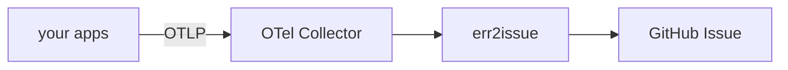

# Diagrams

Sources live here so diagrams stay editable. A picture with no source is a dead
end — the next person has to redraw it from scratch to change one box.

## Policy

**Mermaid is the default.** It renders natively on GitHub, diffs as text, needs
no tooling, and lives inline with the prose it explains. Use it for
architecture, flows, sequences, and state machines — every diagram in
[README.md](../../README.md) and [ISSUE_CONTRACT.md](../ISSUE_CONTRACT.md) is
Mermaid.

**Excalidraw for conceptual sketches** where the hand-drawn quality carries
meaning: whiteboard-style overviews, annotated explanations, anything you would
actually draw on a whiteboard. Commit the `.excalidraw` file here.

Whichever you use: **if you change the architecture, change the diagram in the
same pull request.** A stale diagram is worse than none, because people trust it.

## Files

| File | Shows |
|---|---|
| `architecture.excalidraw` | End-to-end flow: apps → collector → err2issue pipeline → GitHub issue → consumers |

## Editing an Excalidraw diagram

1. Open <https://excalidraw.com>
2. **File → Open**, choose the `.excalidraw` file
3. Edit
4. **File → Save to…**, overwrite the same path
5. Commit the changed `.excalidraw`

To embed it in a document, export **File → Export image → SVG** with *Embed
scene* ticked (that keeps the SVG editable too), save it alongside the source,
and reference the SVG.

## Writing Mermaid

Fenced block, `mermaid` language tag:

````markdown

````

Two things that bite:

- **Quote any label containing punctuation.** `A[foo (bar)]` breaks the parser;
  `A["foo (bar)"]` is fine. Parentheses, colons, and slashes all need quotes.
- **Check it renders before committing.** Paste into
  <https://mermaid.live> — a syntax error renders as a red error box on GitHub,
  in the most visible file you have.
