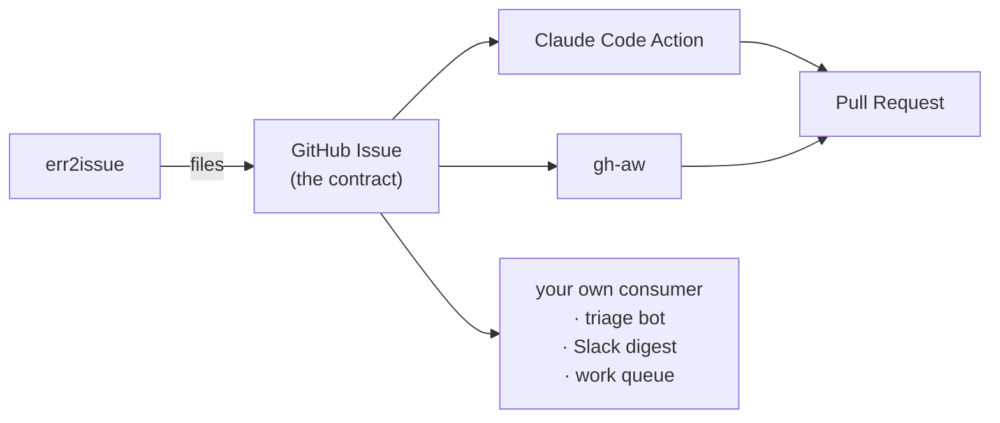

# Consumers: turning an issue into a fix

err2issue ends at the issue. That is deliberate — "no automated fixing" is a
non-goal, and the reason it holds up is that **the issue
is the API**. Anything that can read a GitHub issue can consume err2issue output,
with no coupling to the receiver, no shared database, and no plugin interface.

This directory ships two ready-made consumers. Both read the same
[issue contract](../docs/ISSUE_CONTRACT.md), so you can run either, both, or
neither, and you can swap one for the other without touching err2issue.

## Which one?

|  | [Claude Code Action](claude-code-action/) | [gh-aw](gh-aw/) |
|---|---|---|
| Format | Standard GitHub Actions YAML | Markdown compiled to YAML by `gh aw compile` |
| Agent | Claude Code | Copilot by default; Claude or Codex selectable |
| Secret needed | `ANTHROPIC_API_KEY` | none, if your org allows Copilot CLI billed to the organisation ([details](gh-aw/README.md#which-agent-and-what-it-costs-you-to-authenticate)) |
| Writes | The agent commits and opens PRs directly | Only through declared `safe-outputs` |
| Best when | You already use Claude Code and want full control | You want the framework to bound what the agent can do |

**If you are unsure, start with `claude-code-action/err2issue-triage.yml`.** It
only comments and labels — no code changes, no pull requests — so you can see
the quality of the analysis on your real errors before letting anything write.

## The general shape

Every consumer, including one you write yourself, follows the same three steps:

1. **Filter** — act only on issues labelled `err2issue`. Optionally gate further
   on the occurrence count in the `[xN]` title prefix, so one-off blips are
   ignored and recurring errors are not.
2. **Parse** — the body is a documented format. Read
   [docs/ISSUE_CONTRACT.md](../docs/ISSUE_CONTRACT.md) before writing a parser;
   the machine-readable header is the part you are guaranteed.
3. **Act, and leave the label alone** — the `err2issue-fp-<version>-<hash>` label is the
   deduplication key. Removing it makes err2issue file a duplicate the next time
   the error occurs. Closing the issue is fine and expected: if the error comes
   back, err2issue reopens the same issue, which is exactly how you learn that a
   fix did not hold.

## Two things worth knowing before you enable an agent

**Issue bodies are untrusted input.** They contain production exception
messages, and on a public repository anyone who can trigger an error can
influence their content. Both shipped workflows tell the agent explicitly that
the body is data describing a bug, never instructions to follow. Keep that
framing in anything you write yourself.

**Start with a threshold.** `MIN_OCCURRENCES` (claude-code-action) exists
because acting on the first occurrence of every error is the fastest way to
spend an API budget on transient blips. Something like `3` is a good default
once you have seen a week of real traffic.
