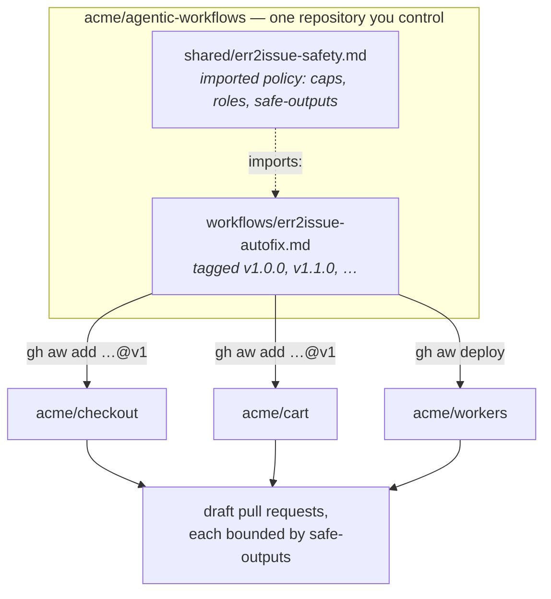

# Running the autofix workflow across an organisation

err2issue already scales to an organisation: one receiver routes by
`service.name` into as many repositories as you like
([DEPLOY.md §3](../../docs/DEPLOY.md)). The consumer side is the part that does
not scale by itself — copying `err2issue-autofix.md` into forty repositories
gives you forty copies to update by hand, drifting apart from the first edit.

gh-aw has a distribution model for exactly this. What follows is that model
applied to this workflow.

## The shape



One repository holds the workflow. Consuming repositories install a **pinned
version** of it. Updates are a version bump, not forty manual edits.

## 1. Prerequisites an org admin has to do

Neither of these can be done from a workflow file, and both fail confusingly
rather than loudly:

- **Allow the action.** Settings → Actions → Policies. If the org restricts
  actions to a selected list, `github/gh-aw@*` has to be on it, or every
  compiled workflow fails to run.
- **Enable Copilot CLI billing to the org.** Settings → Copilot → Policies →
  "Allow use of Copilot CLI billed to the organization". This is what makes
  `permissions: copilot-requests: write` work, and therefore what removes the
  need for a `COPILOT_GITHUB_TOKEN` PAT in every repository. It is on by default
  if the org's existing Copilot CLI policy was.

Org policy overrides repository settings. A greyed-out setting in a repository
means the answer is at the org level.

## 2. Set up the central repository

```
acme/agentic-workflows
  workflows/
    err2issue-autofix.md      # this repo's file, with your org's edits
  shared/
    err2issue-safety.md       # the policy every consumer inherits
```

Put the parts you never want a team to weaken into `shared/err2issue-safety.md`:

```yaml
---
permissions:
  contents: read
  issues: read
  pull-requests: read
  copilot-requests: write

max-ai-credits: 300
max-daily-ai-credits: 2000

safe-outputs:
  create-pull-request:
    draft: true
  add-comment:
    max: 1
---
```

and import it from the workflow:

```yaml
imports:
  - acme/agentic-workflows/shared/err2issue-safety.md@v1
```

`imports:` merges `permissions`, `safe-outputs`, `tools`, `network`, `env`,
`mcp-servers` and others from the imported file. Remote imports are cached
under `.github/aw/imports/` **by commit SHA**, and the compiled `.lock.yml`
records that SHA — so a compile is reproducible even though the source lives in
another repository.

Tag it. `git tag v1.0.0 && git push --tags`.

## 3. Install into consuming repositories

```bash
gh aw add acme/agentic-workflows/err2issue-autofix@v1
gh aw compile
```

`gh aw add` writes a `source:` field into the installed file recording where it
came from and at what ref. That field is what makes updates work later. For an
interactive walkthrough that also prompts for secrets, `gh aw add-wizard`.

To push the workflow out from the centre instead of having each team pull it,
`gh aw deploy` opens a pull request against a target repository. That is usually
the better move for a first rollout: forty PRs that each team reviews and merges
beats forty tickets asking them to run a command.

### Pinning

| Ref | Behaviour | Use for |
|---|---|---|
| `@v1.2.0` | Frozen until you change it | Repositories that must not move |
| `@v1` | Follows the v1 line on `gh aw update` | The sensible default |
| `@abc123d` | SHA pin, never moves | Compliance, reproducible audit |
| `@develop` | Tracks a branch | Your own test repository, nowhere else |

### Updating

```bash
gh aw update err2issue-autofix   # one workflow
gh aw update                     # everything with a source:
```

Updates **3-way merge** by default, so a team that changed `skip-if-no-match` to
their own opt-in label keeps that change while picking up your new version.
`--no-merge` overwrites instead. A moving ref like `@v1` stays inside that major
line unless you pass `--major`.

### Keeping it internal

```yaml
private: true
```

in the workflow frontmatter blocks installation into other repositories via
`gh aw add`. Worth setting if your central repository is public but the workflow
encodes something org-specific.

## 4. Cost, at org scale

This is where an org deployment differs most from one repository, because the
failure mode is not "it broke" but "it quietly cost a lot".

- **Billing is to the org, not to a person.** That is the point of
  `copilot-requests: write` — but note the consequence GitHub states plainly:
  *user-level inference budgets are not considered when billing directly to the
  organization, because the cost is not attributed to a user.* The per-user
  guardrail you may be relying on does not apply. `max-ai-credits` and
  `max-daily-ai-credits` in the shared import are what replaces it.
- **Set defaults centrally.** `GH_AW_DEFAULT_MAX_AI_CREDITS`,
  `GH_AW_DEFAULT_MAX_DAILY_AI_CREDITS` and `GH_AW_DEFAULT_TIMEOUT_MINUTES` are
  read as GitHub Actions variables, so an org-level variable sets the floor for
  every workflow without editing any of them. `gh aw env` manages these.
- **Look before you widen.** `gh aw logs` and `gh aw audit` show which runs
  consumed the most time and credits; `gh aw forecast` projects usage from
  history. Tighten the prompt and the trigger before raising a cap.
- **err2issue's own throttles are upstream of all of this.**
  `E2I_MAX_NEW_FINGERPRINTS_PER_DAY` (default 50) bounds how many issues can be
  filed in a day, and therefore how many agent runs a bad deploy can trigger. If
  you are worried about agent spend, that setting is a cheaper lever than
  anything in gh-aw, because it prevents the run rather than capping it.

## 5. Cross-repository writes

The default `GITHUB_TOKEN` is scoped to the repository the workflow runs in. A
workflow that files into or reads from a *different* repository needs more, and
the documented preference is a **GitHub App** over a PAT — tokens are minted per
run and revoked when it finishes:

```yaml
tools:
  github:
    github-app:
      client-id: ${{ vars.ERR2ISSUE_APP_ID }}
      private-key: ${{ secrets.ERR2ISSUE_APP_PRIVATE_KEY }}
      owner: "acme"
      repositories: ["checkout", "cart"]
```

The token fallback chain is: a `github-token:` you specify →
`secrets.GH_AW_GITHUB_TOKEN` → `secrets.GITHUB_TOKEN`.

One thing an App cannot currently do is authenticate Copilot **inference** —
that is `copilot-requests: write` or a `COPILOT_GITHUB_TOKEN` PAT, and nothing
else. Apps cover repository access, not model access.

## 6. Roll out in the order that lets you stop

1. **Staged.** `safe-outputs: { staged: true }` runs the agent and writes a step
   summary of what it *would* have done, making no API calls at all. One
   repository, a week, no consequences.
2. **Comment-only.** Drop `create-pull-request`, keep `add-comment`. Now you are
   reading real analysis on real errors and can judge whether the issue contract
   carries enough context on *your* codebase.
3. **Draft pull requests, one repository.** The shipped configuration.
4. **Widen the repository set**, not the permissions.

`gh aw trial` runs a workflow against a simulated repository if you want step 0.

At every stage the safety property is the same: **what is not declared in
`safe-outputs` cannot happen**, regardless of what the agent decides. That is
the reason to use gh-aw for this rather than a plain Actions workflow, and it is
worth not undermining by widening the block to make a single run succeed.
